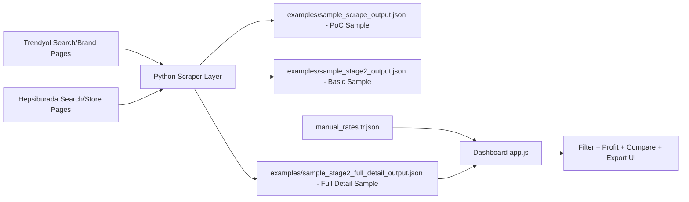
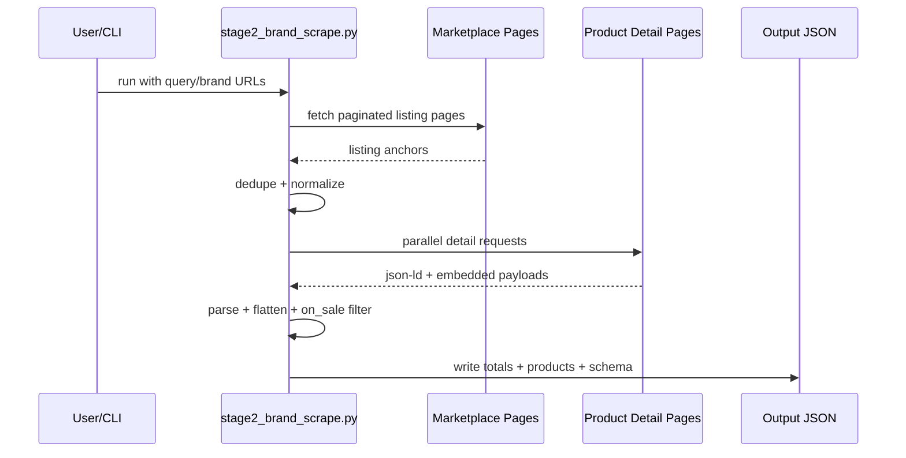
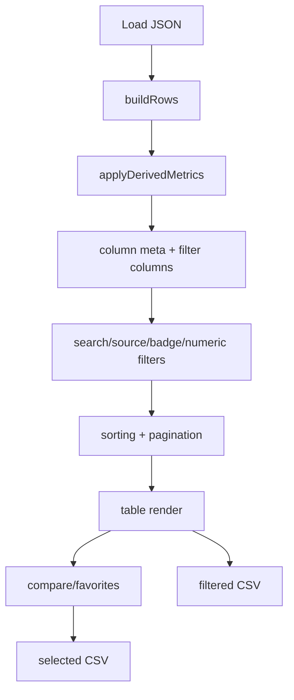
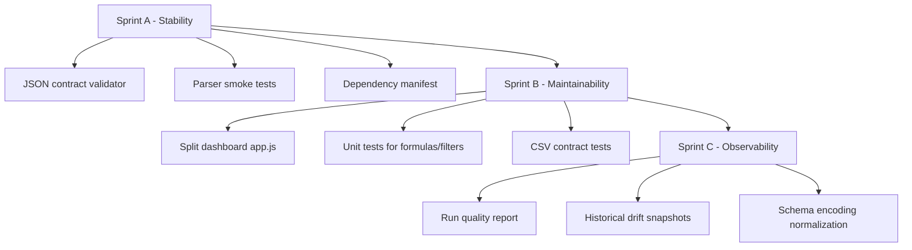

# Scraper Lens

Marketplace scraping + analytics dashboard for Trendyol and Hepsiburada.

## Public Sample Notice

| Item | Value |
| --- | --- |
| Data policy | Synthetic sample data only |
| Default sample dataset | `examples/sample_stage2_full_detail_output.json` |
| Real scrape outputs | Not committed to repository |
| Privacy | Personal paths and private logs removed |

## Table of Contents

1. [Turkce Dokumantasyon](#turkce-dokumantasyon)
2. [English Documentation](#english-documentation)
3. [Related Docs](#related-docs)

---

## Turkce Dokumantasyon

## 1) Proje Ozeti

Bu repo iki ana parcadan olusur:

1. Python scraper katmani:
   - Liste sayfalarindan urun URL toplar.
   - Urun detayindan fiyat/stok/satici/rating ve opsiyonel tam detay kolonlari cikarir.
2. Dashboard katmani:
   - JSON ciktilarini yukler.
   - Kar motoru, filtreleme, siralama, karsilastirma ve CSV export sunar.

Amac: pazar yeri urunlerini hizli sekilde analiz edip ticari karar destegi saglamak.

## 2) Mimari Gorunum



## 3) Veri Akisi (Scrape Run)



## 4) Dizin Yapisi

```text
Scraper/
|- poc_trendyol_hepsiburada.py
|- stage2_brand_scrape.py
|- README.md
|- examples/
|  |- sample_scrape_output.json
|  |- sample_stage2_output.json
|  |- sample_stage2_full_detail_output.json
|  |- sample_stage2_full_detail_columns.txt
|  \- sample_report_summary.txt
|- docs/
|  \- TECHNICAL_AUDIT.md
\- dashboard/
   |- index.html
   |- app.js
   |- styles.css
   |- README.md
   |- start_dashboard.ps1
   |- stop_dashboard.ps1
   \- config/manual_rates.tr.json
```

## 5) Hizli Baslangic

### Gereksinimler

1. Python 3.x
2. `scrapling` paketi (mevcut ortamda import dogrulandi)
3. Tarayici (dashboard icin)

### Komutlar

PoC scrape:

```powershell
python poc_trendyol_hepsiburada.py --query iphone --limit 20 --output scrape_output.json
```

Stage-2 basic:

```powershell
python stage2_brand_scrape.py --query sample-brand --workers 8 --output stage2_brand_output.json
```

Stage-2 full detail (onerilen):

```powershell
python stage2_brand_scrape.py `
  --query sample-brand `
  --trendyol-brand-url "https://www.trendyol.com/sample-brand-x-b000" `
  --hepsiburada-brand-url "https://www.hepsiburada.com/magaza/sample-brand" `
  --max-pages-trendyol 45 `
  --max-pages-hepsiburada 5 `
  --workers 10 `
  --full-detail `
  --output stage2_brand_full_detail_output.json
```

Not: Gercek scrape ciktilari varsayilan olarak repoya eklenmez; acik kaynak icin `examples/` altindaki sentetik dosyalar kullanilir.

Dashboard baslat:

```powershell
cd dashboard
.\start_dashboard.ps1
```

Dashboard durdur:

```powershell
cd dashboard
.\stop_dashboard.ps1
```

URL:

```text
http://localhost:8787/dashboard/
```

## 6) Dashboard Is Akisi



## 7) Veri Sozlesmeleri (Contract Ozet)

| Dosya | Seviye | Ana Alanlar |
| --- | --- | --- |
| `examples/sample_scrape_output.json` | PoC sample | `query`, `sites[]`, `sites[].products[]` |
| `examples/sample_stage2_output.json` | Stage-2 basic sample | `settings`, `listing_totals`, `detail_totals`, `on_sale_products[]` |
| `examples/sample_stage2_full_detail_output.json` | Stage-2 full sample | `detail_schema`, `other_seller_totals`, `on_sale_products[].detail_columns` |
| `dashboard/config/manual_rates.tr.json` | Profit config | `defaults`, `commission_rates[]`, `shipping_rates[]` |

## 8) Kar Motoru Ozet Formulleri

TRY bazli urunler icin:

1. `commission_amount_tl = price * (commission_rate_pct / 100)`
2. `net_after_fee_tl = price - commission_amount_tl - shipping_estimated_tl - extra_fee_tl`
3. `max_buy_price_for_target_profit_tl = net_after_fee_tl / (1 + target_profit_pct / 100)` (net pozitifse)
4. Alis fiyati girildiyse:
   - `net_profit_after_purchase_tl = net_after_fee_tl - purchase_price_tl`
   - `profit_ratio_pct = (net_profit_after_purchase_tl / purchase_price_tl) * 100`

## 9) Riskler ve Sinirlar

| Risk | Etki | Not |
| --- | --- | --- |
| Upstream HTML/JSON degisimi | Yuksek | Parser davranisi kirilabilir |
| Otomatik test eksikligi | Yuksek | Regresyon erken yakalanamayabilir |
| Dashboard tek dosya JS yapisi | Orta-Yuksek | Bakim maliyeti artar (`app.js` buyuk) |
| Paket manifest eksigi | Orta | Ortam tekrar üretilebilirligi zayif |
| Heuristik metrikler | Orta | Satis/desi tahmini zamanla sapabilir |

## 10) Gelistirme Yol Haritasi



## 11) Sorun Giderme

| Problem | Kontrol | Cozum |
| --- | --- | --- |
| Dashboard acilmiyor | Port `8787` dinleniyor mu? | `.\stop_dashboard.ps1` sonra `.\start_dashboard.ps1` |
| Varsayilan JSON yuklenmiyor | Dosya yolu dogru mu? | Manuel `JSON Dosyasi Sec` ile yukle |
| Scrape sonucu zayif | Upstream sayfa degisti mi? | Parser alanlarini fixture ile test et |
| Kar hesaplari beklenmedik | Rate config guncel mi? | `manual_rates.tr.json` oranlarini kontrol et |

---

## English Documentation

## 1) Project Summary

This repository has two main parts:

1. Python scraper layer:
   - collects product URLs from listing pages.
   - extracts price/stock/seller/rating and optional full detail columns from product pages.
2. Dashboard layer:
   - loads JSON outputs.
   - provides profit engine, filtering, sorting, compare, and CSV export.

Goal: provide fast marketplace analysis and decision support.

## 2) Architecture Overview


## 3) Data Flow (Scrape Run)


## 4) Repository Layout

```text
Scraper/
|- poc_trendyol_hepsiburada.py
|- stage2_brand_scrape.py
|- README.md
|- examples/
|  |- sample_scrape_output.json
|  |- sample_stage2_output.json
|  |- sample_stage2_full_detail_output.json
|  |- sample_stage2_full_detail_columns.txt
|  \- sample_report_summary.txt
|- docs/
|  \- TECHNICAL_AUDIT.md
\- dashboard/
   |- index.html
   |- app.js
   |- styles.css
   |- README.md
   |- start_dashboard.ps1
   |- stop_dashboard.ps1
   \- config/manual_rates.tr.json
```

## 5) Quick Start

### Requirements

1. Python 3.x
2. `scrapling` package
3. Browser (for dashboard)

### Commands

PoC scrape:

```powershell
python poc_trendyol_hepsiburada.py --query iphone --limit 20 --output scrape_output.json
```

Stage-2 basic:

```powershell
python stage2_brand_scrape.py --query sample-brand --workers 8 --output stage2_brand_output.json
```

Stage-2 full detail (recommended):

```powershell
python stage2_brand_scrape.py `
  --query sample-brand `
  --trendyol-brand-url "https://www.trendyol.com/sample-brand-x-b000" `
  --hepsiburada-brand-url "https://www.hepsiburada.com/magaza/sample-brand" `
  --max-pages-trendyol 45 `
  --max-pages-hepsiburada 5 `
  --workers 10 `
  --full-detail `
  --output stage2_brand_full_detail_output.json
```

Note: Real scrape outputs are intentionally excluded from version control; use the synthetic public samples in `examples/`.

Start dashboard:

```powershell
cd dashboard
.\start_dashboard.ps1
```

Stop dashboard:

```powershell
cd dashboard
.\stop_dashboard.ps1
```

URL:

```text
http://localhost:8787/dashboard/
```

## 6) Dashboard Runtime Flow


## 7) Data Contracts (Summary)

| File | Level | Key fields |
| --- | --- | --- |
| `examples/sample_scrape_output.json` | PoC sample | `query`, `sites[]`, `sites[].products[]` |
| `examples/sample_stage2_output.json` | Stage-2 basic sample | `settings`, `listing_totals`, `detail_totals`, `on_sale_products[]` |
| `examples/sample_stage2_full_detail_output.json` | Stage-2 full sample | `detail_schema`, `other_seller_totals`, `on_sale_products[].detail_columns` |
| `dashboard/config/manual_rates.tr.json` | Profit config | `defaults`, `commission_rates[]`, `shipping_rates[]` |

## 8) Profit Engine Formulas

For TRY-priced rows:

1. `commission_amount_tl = price * (commission_rate_pct / 100)`
2. `net_after_fee_tl = price - commission_amount_tl - shipping_estimated_tl - extra_fee_tl`
3. `max_buy_price_for_target_profit_tl = net_after_fee_tl / (1 + target_profit_pct / 100)` (if net positive)
4. If purchase price exists:
   - `net_profit_after_purchase_tl = net_after_fee_tl - purchase_price_tl`
   - `profit_ratio_pct = (net_profit_after_purchase_tl / purchase_price_tl) * 100`

## 9) Risks and Constraints

| Risk | Impact | Note |
| --- | --- | --- |
| Upstream HTML/JSON changes | High | parser behavior may break |
| Missing automated tests | High | regressions may be missed |
| Single-file dashboard JS | Medium-High | higher maintenance cost |
| Missing dependency manifest | Medium | weak reproducibility |
| Heuristic metrics | Medium | sales/desi estimates may drift |

## 10) Improvement Roadmap


## 11) Troubleshooting

| Problem | Check | Fix |
| --- | --- | --- |
| Dashboard not opening | Is port `8787` listening? | Run `.\stop_dashboard.ps1` then `.\start_dashboard.ps1` |
| Default JSON not loading | Is path correct? | Use `JSON Dosyasi Sec` manual upload |
| Weak scrape output | Did upstream markup change? | Re-test parser fields against fixtures |
| Unexpected profit values | Are rates current? | Review `manual_rates.tr.json` |

---

## Related Docs

1. Full technical audit: `docs/TECHNICAL_AUDIT.md`
2. Dashboard-focused guide: `dashboard/README.md`

---

## Open Source / Acik Kaynak Kullanimi

### TR - Nasil Kullanilir?

1. Repoyu klonla:

```powershell
git clone <REPO_URL>
cd <REPO_NAME>
```

2. Python bagimliligini kur:

```powershell
pip install scrapling
```

3. Scrape calistir (full detail onerilir):

```powershell
python stage2_brand_scrape.py `
  --query sample-brand `
  --trendyol-brand-url "https://www.trendyol.com/sample-brand-x-b000" `
  --hepsiburada-brand-url "https://www.hepsiburada.com/magaza/sample-brand" `
  --max-pages-trendyol 45 `
  --max-pages-hepsiburada 5 `
  --workers 10 `
  --full-detail `
  --output stage2_brand_full_detail_output.json
```

4. Dashboard ac:

```powershell
cd dashboard
.\start_dashboard.ps1
```

5. Tarayicida:

```text
http://localhost:8787/dashboard/
```

### EN - How to Use

1. Clone the repository:

```powershell
git clone <REPO_URL>
cd <REPO_NAME>
```

2. Install dependency:

```powershell
pip install scrapling
```

3. Run full-detail scraping:

```powershell
python stage2_brand_scrape.py `
  --query sample-brand `
  --trendyol-brand-url "https://www.trendyol.com/sample-brand-x-b000" `
  --hepsiburada-brand-url "https://www.hepsiburada.com/magaza/sample-brand" `
  --max-pages-trendyol 45 `
  --max-pages-hepsiburada 5 `
  --workers 10 `
  --full-detail `
  --output stage2_brand_full_detail_output.json
```

4. Start dashboard:

```powershell
cd dashboard
.\start_dashboard.ps1
```

5. Open:

```text
http://localhost:8787/dashboard/
```

### Open Source Publishing Checklist

1. Create a public GitHub repository.
2. Keep the included `MIT` license file (`LICENSE`) or replace with your preferred OSS license.
3. Add remote:

```powershell
git remote add origin <REPO_URL>
```

4. Push main branch:

```powershell
git push -u origin main
```
