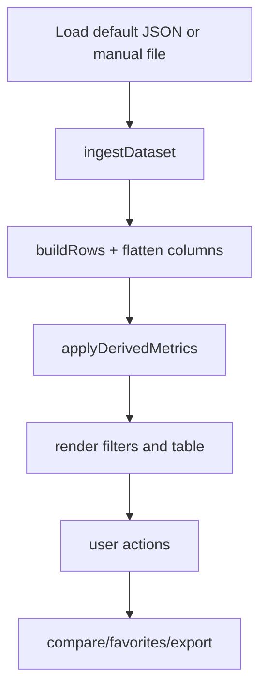

# Dashboard Module Guide

This file documents the dashboard module only.  
For full project context, see root `README.md`.

## TR - Dashboard Ozet

`dashboard/` klasoru, scraper ciktilarini (ozellikle full detail JSON) yukleyip analiz etmeye yarayan web arayuzunu barindirir.

## Moduller

| Dosya | Rol |
| --- | --- |
| `index.html` | Sayfa iskeleti, kontrol alanlari, modal yapisi |
| `styles.css` | Tema, layout, responsive davranis |
| `app.js` | Veri ingest + metrik hesap + filtreleme + render + export |
| `config/manual_rates.tr.json` | Komisyon/kargo/fallback oranlari |
| `start_dashboard.ps1` | Dashboard local server baslatma |
| `stop_dashboard.ps1` | Dashboard local server durdurma |

## Ozellik Seti

1. Kaynak, badge, genel arama ve sayisal filtreler.
2. Gelismis kolon bazli filtreleme.
3. Kar motoru (komisyon/kargo/ek kesinti + hedef kar).
4. Tahmini desi, satis sinyali, satici bazli gorunumler.
5. Favori, karsilastirma paneli, secili CSV export.
6. Filtreli tum sonuc CSV export.
7. LocalStorage ile UI/favori/karsilastirma kaliciligi.

## Runtime Akisi



## Calistirma

Onerilen:

```powershell
cd dashboard
.\start_dashboard.ps1
```

Durdurma:

```powershell
cd dashboard
.\stop_dashboard.ps1
```

Alternatif (manuel):

```powershell
cd dashboard
python -m http.server 8787
```

URL:

```text
http://localhost:8787/dashboard/
```

## Veri Beklentisi

Varsayilanlar:

1. `../examples/sample_stage2_full_detail_output.json`
2. `./config/manual_rates.tr.json`

Eger varsayilan JSON acilamazsa, arayuzdeki `JSON Dosyasi Sec` ile manuel yukleme yapilabilir.

## Kar Motoru Notu

Dashboard, kategori + kaynak bazli komisyon/kargo oranlarini `manual_rates.tr.json` dosyasindan okur.  
Oran bulunamazsa fallback degerlerine doner.

## Sorun Giderme

| Problem | Kontrol | Cozum |
| --- | --- | --- |
| Acilis yok | Port 8787 dolu mu? | Stop script sonra start script |
| Bos tablo | JSON yapisi uygun mu? | Full-detail output kullan |
| Beklenmeyen kar | Rate config guncel mi? | `manual_rates.tr.json` kontrol et |

---

## EN - Dashboard Summary

The `dashboard/` folder contains the web UI that loads scraper outputs (mainly full-detail JSON) and provides interactive analysis.

## Module Map

| File | Responsibility |
| --- | --- |
| `index.html` | Page structure, controls, modal containers |
| `styles.css` | Theme, layout, responsive behavior |
| `app.js` | Ingest + derived metrics + filtering + rendering + export |
| `config/manual_rates.tr.json` | Commission/shipping/fallback rates |
| `start_dashboard.ps1` | Start local dashboard server |
| `stop_dashboard.ps1` | Stop local dashboard server |

## Feature Set

1. Source, badge, full-text, and numeric filtering.
2. Advanced per-column filters.
3. Profit engine (commission/shipping/extra fee + target margin).
4. Estimated desi, sales signal, and seller-centric views.
5. Favorites, compare panel, selected CSV export.
6. Full filtered CSV export.
7. LocalStorage-backed persistence for UI/favorites/compare state.

## Runtime Flow


## Run

Recommended:

```powershell
cd dashboard
.\start_dashboard.ps1
```

Stop:

```powershell
cd dashboard
.\stop_dashboard.ps1
```

Manual fallback:

```powershell
cd dashboard
python -m http.server 8787
```

URL:

```text
http://localhost:8787/dashboard/
```

## Data Expectations

Default files:

1. `../examples/sample_stage2_full_detail_output.json`
2. `./config/manual_rates.tr.json`

If default JSON fails, use `JSON Dosyasi Sec` in the UI.

## Profit Engine Note

The dashboard reads commission/shipping rates from `manual_rates.tr.json`, then falls back to default values if no category-source match exists.

## Troubleshooting

| Problem | Check | Fix |
| --- | --- | --- |
| UI not opening | Is port 8787 busy? | Run stop script then start script |
| Empty table | Is JSON contract valid? | Use full-detail output |
| Unexpected margins | Are rates current? | Review `manual_rates.tr.json` |

---

Back to main documentation: `../README.md`
